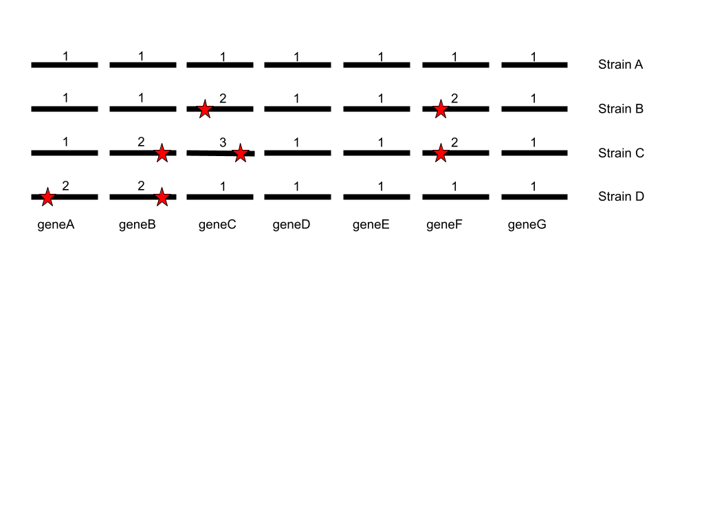

# MLST 
MLST (multi-locus sequence typing) was first developed [in 1998 for _N.
meningitidis_](https://www.ncbi.nlm.nih.gov/pmc/articles/PMC19708/). The idea is
to select a set of loci in the genome, and get the alleles in each genome for
these loci. Typing is then done by seeing what isolates have which combination
of alleles for each locus.

## Schema
With MLST, the focus is on a subset of genes or loci that are known to be
present in most, if not all strains of that species, but which are also known to
have some sequence variation. The loci selected for use in MLST constitute the
schema for that species. Commonly, for the original type of MLST, the number of
genes chosen was 7. These are commonly housekeeping genes. There are several
extensions of this that have come in later years, among them core genome MLST
(cgMLST) and ribosomal MLST (rMLST). The main difference between the methods is
in the criteria for how loci are included in the schema.

## Allele and nomenclature
For each gene or locus in the schema, it is possible to have different sequence
variants, or alleles. The different variants that have been observed can be
collected in a database. Each observed allele for a gene can in this database
be given a label, commonly a number. It is important to realize that these
labels or numbers are attributed sequentially when detected, but do NOT provide
any indication of relatedness or similarity between the alleles.

For the original “7-gene” type of MLST, several international nomenclature
databases with alleles have been established. With access to such nomenclature
databases, it is possible to ensure that all alleles have a unique number. This
means that if using the same schema and the same database, two institutions can
exchange information and know that they are referring to the same alleles.

## Profile and sequence type
Each isolate can be typed by finding the sequence for each of the loci the
schema contains. Once the sequence is found, it is compared to known alleles for
that locus. This is usually done by comparing to alleles downloaded or otherwise
accessed from the nomenclature server. If it is identical to an allele from the
nomenclature database, the allele number for that locus is assigned to that
isolate. If not, the allele is commonly uploaded to the server, which then
assigns it a new number. This process happens automatically in some tools, in
other cases it is done manually. The set of identifiers for an isolate is called
its profile. The profile is commonly collapsed into a sequence type number,
where each ST represents a unique combination of alleles for each locus.

Provided that the allele numbers and sequence type numbers are assigned by the
same central nomenclature server, sequence types can be compared between
institutions. Some institutions, like EFSA, can under certain circumstances
allow organizations to submit sequence types, thus avoiding the need for
uploading the full sequence.  

## MLST resources

### Typing/Nomenclature databases

There are three main MLST nomenclature/database servers.  
* https://pubmlst.org/
* https://bigsdb.pasteur.fr/
* https://enterobase.warwick.ac.uk/

It is important to realize that these work independently from each other and may
contain different schemas, and even if they have the same schema there is no
guarantee that the allele numbering is the same. Thus a sequence type only makes
sense provided it is known which system has been used.

### MLST finding methods

There are two main strategies for finding MLST genes.

* Assembly strategy: in this case the genomes are first assembled. Next, the
  allele set included in the typing database is used to search the genome,
  [commonly using BLAST](https://blast.ncbi.nlm.nih.gov/Blast.cgi). The results
  are subsequently post-processed to get the allele and then compared to a
  profile database to assign ST numbers.

* Mapping strategy: in this case, the reads for each isolate are mapped against
  the allele typing database. Next, those reads are collected and assembled into
  genes. These are then compared to the alleles in the database, and allele and
  ST numbers are assigned.

This figure shows how MLST works. In this case there are seven loci or genes
being used, genes A to G. Strain A is the first strain that is classified, thus
each version or allele of these genes are given the number 1. Subsequent new
alleles found in other strains are then given new numbers as they are found.
Note, the numbers are specific to each locus or gene, thus two different alleles
within the same strain can have the same number.

### MLST software
There are many tools for doing MLST from both reads and assemblies available. It
is important to realize that even though they might use the same schema, they
might not give the same results. [A review of various MLST tools and their
results can be found in this
paper](https://www.microbiologyresearch.org/content/journal/mgen/10.1099/mgen.0.000124).
Due to this review no extensive examination of tools is given here. Some
communities lean towards using certain tools, if so, these are mentioned in the
Species specific sections.

