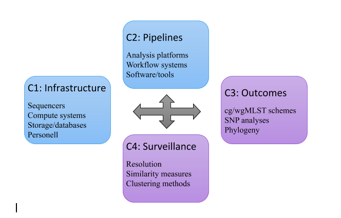

# About the OH SFS Handbook

The work found in these pages got its start in the ORION project. This project,
launched in 2018, is aimed at establishing and strengthening
inter-institutional collaboration and transdisciplinary knowledge transfer in
the area of surveillance data integration and interpretation, along the One
Health (OH) objective of improving health and well-being.

Through three main work packages (WP), ORION’s specific goals can be summarized
as the delivery of three main resources:

- a “OH Surveillance Codex” (WP1) - a high level framework for harmonised,
cross-sectional description and categorisation of surveillance data covering all
surveillance phases and all knowledge types;
- a “OHS Knowledge Hub” (WP2) - a
cross-domain inventory of currently available data sources, methods / algorithms
/ tools, that support OH surveillance data generation, data analysis, modelling
and decision support;
- “OHS Infrastructural Resources” (WP3) – that are
practical, infrastructural resources forming the basis for successful
harmonisation and integration of surveillance data and methods.

The work in these pages springs out of WP2, and focuses on being an Inventory
over current practices regarding the use of sequencing data for surveillance
purposes.

## Updates and contributions
The underlying technologies within this field is a moving target. It is
thus important to keep this handbook updated with new information.
Contributions to this handbook are very welcome, please see the [Contributing](../Contributing/contributing.md) document for more information.

## Overview of the handbook

This handbook consists of various sections.

**Componets of the handbook** Blue boxes describe species-agnostic processes, while the purple ones depend on which biological agent is being analysed.

**C1: Infrastructure** The focus for this component is on exploring, testing and
*evaluating options and requirements for establishing possible infrastructures
*for using NGS methods for surveillance purposes. This component spans from
*sequencers, to compute systems, storage and databases, user interaction
*systems, data management and data transfer, as well as discussions regarding
*needed expertise. The goal for the component is to document the trials and
*tribulations that come with implementing NextGen technologies for surveillance
*purposes, and to suggest possible practical solutions depending on results
*needed and available resources.

**C2: Analysis pipelines** The focus for this component is on exploring, testing
*and evaluating various possible workflow systems and bacterial typing pipelines
*for a select group of bacterial agents. We will be exploring issues surrounding
*reproducibility, reliability, scalability, ease of maintenance and
*updateability, as well as possibilities for expanding the pipelines to perform
*novel analyses. We will be exploring pipelines for various types of bacterial
*typing, including cg/wgMLST and SNP-based pipelines. This work also includes
*pipelines for virulence and AMR detection.

The goal of this component is to document the implementation and practical use
of one of more bacterial typing pipelines for surveillance use.

**C3: Analysis pipeline outcomes** This component focuses on the various typing
*schemas that exist for bacterial typing, as well as the underlying databases
*and references needed for running analyses. We will here be cataloguing and
*describing which schemas exist, which schemas are in use, and any information
*that is available regarding how changing schemas and databases affect results.
*Similar work will also be done with regards to virulence and AMR detection.

**C4: Surveillance** We will in this component examine how the results from
*various methods from components 2 and 3 can be used for surveillance purposes.
*Included here is how the various outcomes from component 3 will affect the
*surveillance process, and the conclusions drawn on the basis of such data. A
*major factor here is how the different levels of resolution provided by the
*various methods can affect the results. We will also explore and evaluate
*various similarity measures, as well as clustering methods based on such
*measures.
